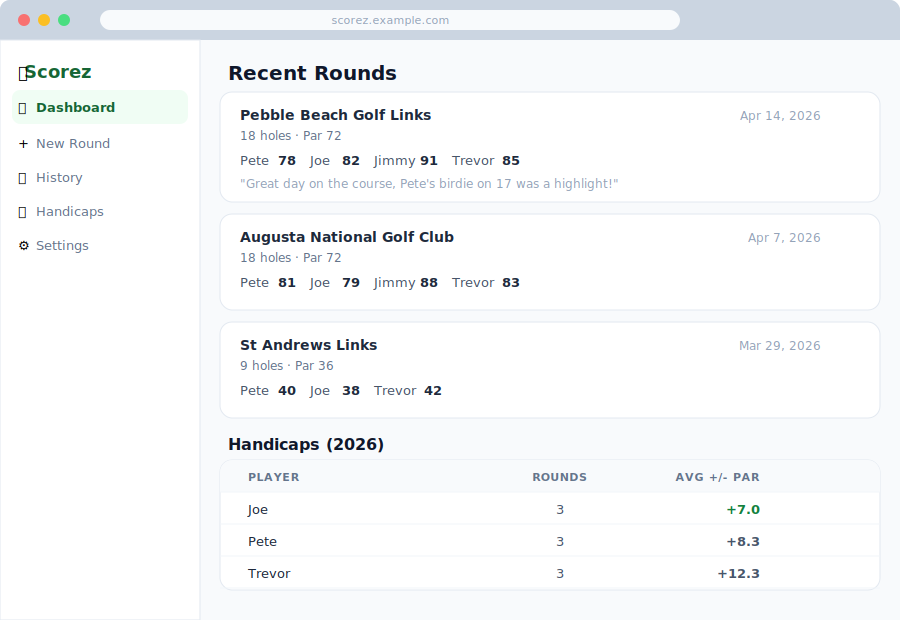

# Scorez

A private web app for tracking golf scores and handicaps for a group of friends. Records rounds, shows history, and calculates year-based handicaps (average of score minus par across all rounds in the current calendar year).

**Stack:** Next.js App Router · Supabase (PostgreSQL + Auth) · Tailwind CSS · Vercel or Render



---

## Local Development

### Prerequisites

- Node.js 18+
- A [Supabase](https://supabase.com) project (free tier is fine)

### 1. Clone and install

```bash
git clone https://github.com/your-username/scorez.git
cd scorez
npm install
```

### 2. Set up environment variables

Copy the example file and fill in your Supabase credentials:

```bash
cp .env.local.example .env.local
```

Edit `.env.local`:

```env
NEXT_PUBLIC_SUPABASE_URL=https://your-project-id.supabase.co
NEXT_PUBLIC_SUPABASE_ANON_KEY=your-anon-key
ANTHROPIC_API_KEY=your-anthropic-api-key   # optional — enables scorecard photo upload
```

Both values are in your Supabase dashboard under **Settings → Data API**.

- **Project URL** format: `https://your-project-id.supabase.co`
- **Anon key**: the publishable/anon key (not the secret key)

> If `ANTHROPIC_API_KEY` is not set, the scorecard upload section on the New Round page is shown as disabled.

### 3. Run database migrations

In the Supabase dashboard, go to **SQL Editor** and run each migration file in order:

1. `supabase/migrations/20260403000000_initial.sql`
2. `supabase/migrations/20260404000001_add_players_table.sql`
3. `supabase/migrations/20260408000001_players_update_policy.sql`
4. `supabase/migrations/20260408000003_round_notes.sql`

### 4. Create your first user

In the Supabase dashboard, go to **Authentication → Users → Invite user** and enter an email. They will receive a link to set their password. Once logged in they can set a display name in **Settings**.

### 5. Start the dev server

```bash
npm run dev
```

Open [http://localhost:3000](http://localhost:3000).

---

## Deploying to Vercel

1. Push the repo to GitHub
2. Import the project at [vercel.com/new](https://vercel.com/new)
3. Add the environment variables in **Project Settings → Environment Variables**:
   - `NEXT_PUBLIC_SUPABASE_URL`
   - `NEXT_PUBLIC_SUPABASE_ANON_KEY`
   - `ANTHROPIC_API_KEY` (optional)
4. Deploy — Vercel detects Next.js automatically

In Supabase → **Authentication → URL Configuration**, set **Site URL** and add a **Redirect URL** pointing to your Vercel deployment URL (e.g. `https://scorez.vercel.app`).

---

## Deploying to Render

A `render.yaml` is included. To deploy:

1. Push the repo to GitHub
2. Go to [render.com](https://render.com) → **New → Blueprint** and connect the repo
3. Render will detect `render.yaml` and create a web service
4. Set the environment variables in the Render dashboard:
   - `NEXT_PUBLIC_SUPABASE_URL`
   - `NEXT_PUBLIC_SUPABASE_ANON_KEY`
   - `ANTHROPIC_API_KEY` (optional)

In Supabase → **Authentication → URL Configuration**, set **Site URL** and add a **Redirect URL** pointing to your Render deployment URL (e.g. `https://scorez.onrender.com`).

> **Note:** Render's free tier spins down services after inactivity — the first request after idle may be slow.

---

## Database migrations

Migrations live in `supabase/migrations/` and must be applied in filename order via the Supabase SQL editor:

| File | Purpose |
|---|---|
| `20260403000000_initial.sql` | Core schema: courses, rounds, round_scores, profiles, RLS |
| `20260404000001_add_players_table.sql` | Standalone players table decoupled from auth |
| `20260408000001_players_update_policy.sql` | Allow any authenticated user to update player names |
| `20260408000003_round_notes.sql` | Round notes table |

---

## Scorecard photo upload

On the **New Round** page, drag and drop or browse to a JPEG, PNG, or WebP photo of a scorecard. The image is sent to a server-side API route which passes it to the Claude vision model. The model extracts:

- Course name
- Date
- Number of holes
- Total par
- Player names and total scores

The form is pre-filled with the extracted data. Player names are fuzzy-matched against existing players so known names map automatically. Review the pre-filled data before saving.

This feature is disabled when `ANTHROPIC_API_KEY` is not configured.
